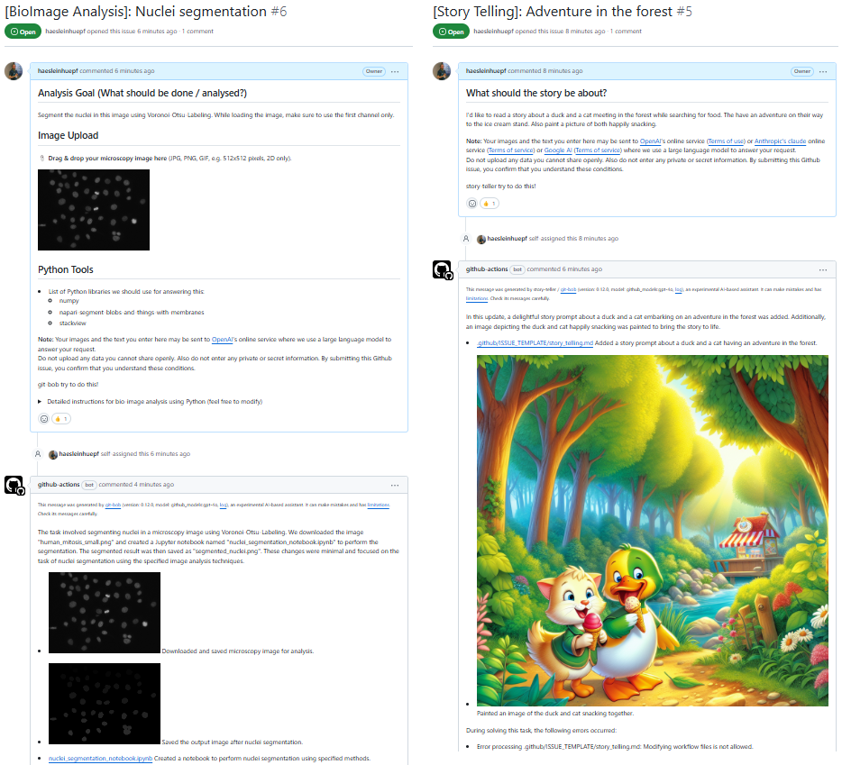

# I2K2024(virtual): Bio-Image Analysis Code Generation

This repository contains training materials for the Tutorial "Bio-Image Analysis Code Generation" at the From Images To Knowledge (I2K) Conference (virtual) October 28th-30th 2024.

It contains Jupyter Notebooks demonstrating [bia-bob](https://github.com/haesleinhuepf/bia-bob), an AI-based assistant for interacting with image data using large language models and for working on Bio-image Analysis tasks. If you plan to execute these notebooks during the session, it is recommended to setup a Conda environment as [explained here](https://scads.github.io/generative-ai-notebooks/00_setup/readme.html).

Furthermore, you can [create an issue](https://github.com/haesleinhuepf/i2k2024-ai-code-generation/issues/new/choose) which will then be answered by [git-bob](https://github.com/haesleinhuepf/git-bob) an AI-assistant that runs inside Github.com's Continuous Integration infrastructure.

**Note:** When using bia-bob and git-bob, the data you provide, the images and the text you enter may be sent to [OpenAI](https://openai.com/)'s or [Anthropic](https://www.anthropic.com/api)'s online services where we use a large language model to answer your request. 
Do not upload any data you cannot share openly. Also, do not enter any private or secret information.

## Exercise 1: Testing bia-bob

Open a new Jupyter notebook, run `import bia_bob` and in a new cell below enter this:

```
%%bob
Please segment the nuclei in the `skimage.data.human_mitosis()` dataset using Voronoi-Otsu-Labeling.
```

Check if the code works. It should look approximately [like this](https://github.com/haesleinhuepf/i2k2024-ai-code-generation/blob/main/examples/voronoi-otsu-labeling1.ipynb).

Afterwards, install [pyclesperanto](https://github.com/clEsperanto/pyclesperanto):
```
pip install pyclesperanto
```

Restart your kernel and ask the same question again. 
It should then look [different](https://github.com/haesleinhuepf/i2k2024-ai-code-generation/blob/main/examples/voronoi-otsu-labeling2.ipynb).

## Exercise 2: Testing git-bob

Create a new issue [here](https://github.com/haesleinhuepf/i2k2024-ai-code-generation/issues/new/choose). It's your choice if you ask a [bio-image analysis question](https://github.com/haesleinhuepf/i2k2024-ai-code-generation/issues/2) or for a [fun story for kids](https://github.com/haesleinhuepf/i2k2024-ai-code-generation/issues/3).




## Feedback welcome

If you would like to provide feedback or have a question, please open a thread on https://image.sc and tag @haesleinhuepf.

## Acknowledgements

We acknowledge the financial support by the Federal Ministry of Education and Research of Germany and by Sächsische Staatsministerium für Wissenschaft, Kultur und Tourismus in the programme Center of Excellence for AI-research „Center for Scalable Data Analytics and Artificial Intelligence Dresden/Leipzig", project identification number: ScaDS.AI
